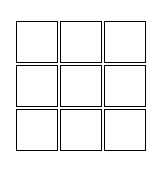
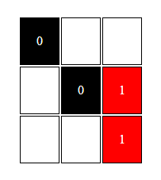
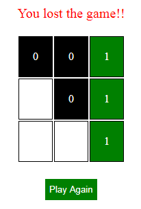
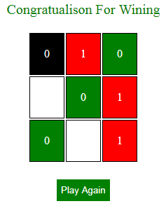

# Tic-Tac-Toe
It is a tic-tac-toe game purely created by javascript.
# Sample Images
This are the sample images
|  |  |
|  |  |
# Demo
[This](https://santanubiswas948.github.io/tic-tac-toe/) is a simple demo of tic-tac-toe game.
# Installation
```sh
  1.you can download it.
  2.You can clone the project folder using git command $ git clone
  https://github.com/santanubiswas948/Tic_Tac_Toe.git
```
# Getting Started
- Then open the index.html using any browser after downloading or cloning in any browser.
# Contributing
Your PRs and stars are always welcome.
- Add your new features or fixes.
- Build the project.
# Contributors
- Santanu Biswas
# Lincense
Liencensed under [MIT](LICENSE).
